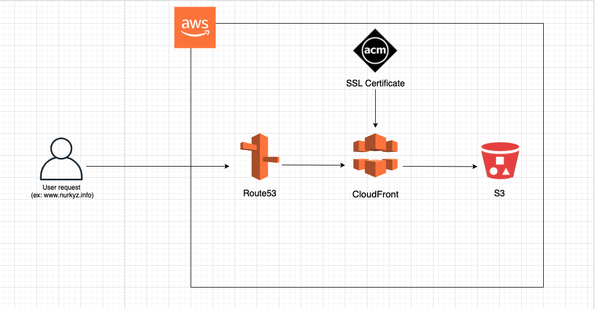

## Hosting a Secure Static Website with AWS by using a Terraform



* ### What does the code deploy? 
 
    - #### S3 bucket [s3_bucket.tf](static-website/s3_bucket.tf) 
        * bucket for our domain to host a website
    
    - #### CloudFront (OAI) [cloudfront.tf](static-website/cloudfront.tf) : 
        * CloudFront Distribution for S3 bucket
        * OAI to access S3 bucket privately

    - #### Route53 (hosted zone) [route53.tf](static-website/route53.tf)
        * alias records for domain with www and without
    
    - #### ACM SSL Certificate
        * SSL Certificate for our domain 

* ### Prerequisites:
    - [Terraform](https://www.terraform.io) Version ~> 0.15.0  and AWS Version ~> 3.40.0 installed on VSCode(or any code editor)
    - Configured Hosted Zone
    - SSL Certificate 

- ### How to deploy the code?

Clone Repo

```
git clone https://github.com/NurkyzUs/static-website.git
```

Initialize the code 
```
 terraform init
```  
Check if the configuration is valid
```
terraform validate
```
Check the execution plan , preview the changes

```
terraform plan
``` 
Create or update the infrastructure
```
terraform apply
```

Destroy the current infrastructure
```
terraform destroy
```
